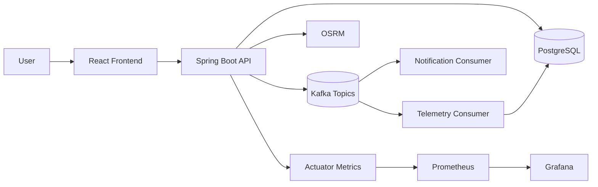
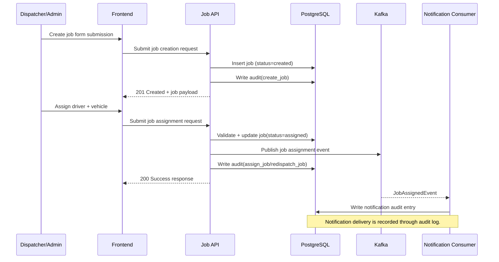
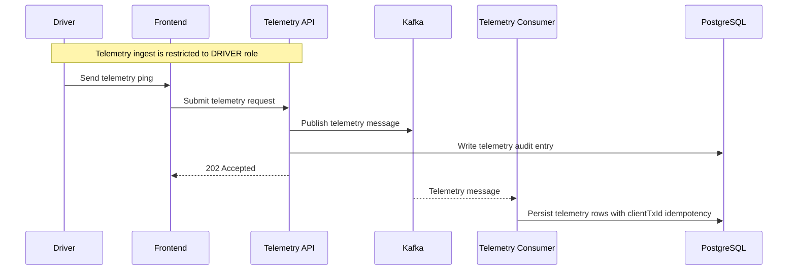
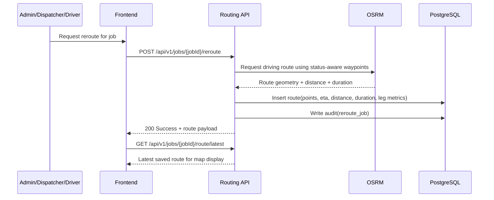

# DEMO Smart Fleet and Logistics Platform (SFLP) Architecture

## 1. Purpose

This document describes the architecture of the Smart Fleet and Logistics Platform (SFLP) demo for technical portfolio use. It focuses on:

- System context and module boundaries
- Main request and event workflows
- Security and data flow design
- Operational and testing practices

## 2. Business Scope

SFLP is an operations platform for managing:

- Fleet assets (vehicles and drivers)
- Job dispatch and lifecycle transitions
- Route/reroute support for active job operations
- Driver telemetry ingestion
- Usage reporting and audit traceability

Primary personas:

- `ADMIN`: full operations including fleet CRUD, account administration, job override transitions, reports, and audit
- `DISPATCHER`: job create/assign/reopen, desk ops (cancel and desk-close from `in_progress`), driver management, and job reroute
- `DRIVER`: telemetry ingest, field job transitions on assigned jobs, scoped job views, and job reroute
- `OPS`: reporting and audit queries only

## 3. Technology Stack

- Backend: Java 21, Spring Boot, Spring Security, Spring Data JPA
- Database: PostgreSQL with Flyway migrations
- Messaging: Kafka (event-driven telemetry and notifications)
- Frontend: React + TypeScript + Vite
- Mapping/Routing: OpenStreetMap tiles + geocoding (Nominatim), OSRM for road routing
- Observability: Spring Actuator, Micrometer, Prometheus, Grafana (local Docker stack)
- Testing: JUnit 5, Testcontainers, architecture tests (ArchUnit)

## 4. System Context

## 5. Backend Module Boundaries

- `auth`
  - Token issuance and refresh flow
  - JWT validation filter and role-based access
  - Account management for admin users
- `fleet`
  - Vehicle and driver management
  - Assignment relationship rules
  - Vehicles: write/update/status change is `ADMIN`-only; list/read is `ADMIN` and `DISPATCHER`
  - Drivers: create/update/list is `ADMIN` and `DISPATCHER`
- `job`
  - Job creation, assignment, transition state machine
  - Job assignment event publication
- `telemetry`
  - Accept telemetry requests quickly (`202 Accepted`); endpoint is `DRIVER`-role only
  - Publish events to Kafka, then persist asynchronously
- `notification`
  - Consume assignment events and generate delivery notifications (mock)
  - Record delivery attempts in audit log
- `billing`
  - Create billing records on job completion
  - Generate usage CSV reports on demand
- `audit`
  - Audit trail for domain actions
  - Paginated audit query API with actor and date range filters
- `reporting`
  - Operational KPI summary endpoint with database aggregation queries
- `routing`
  - Command endpoint for job rerouting (`ADMIN`/`DISPATCHER`, plus `DRIVER` on assigned jobs in allowed statuses)
  - Auto-reroute after selected job transitions (`accepted`, `in_progress`)
  - Route persistence with geometry points, ETA, distance, duration, and leg metrics
  - OSRM-backed status-aware target selection (driver/pickup/dropoff depending on job status)
  - Latest route read endpoint for frontend map display
- `shared`
  - Cross-cutting concerns: `ProblemDetail` exception mapping, correlation ID filter, `PagedResponse<T>`

## 6. Security Architecture

Security model:

- JWT-based stateless authentication for API requests
- Method-level authorization (`@PreAuthorize`) per protected endpoint
- BCrypt password encoding
- CORS configured for local frontend origins
- Refresh token stored in HTTP-only cookie

Request protection flow:

1. Frontend submits credentials to token endpoint.
2. Backend issues access token and refresh session behavior.
3. Frontend sends bearer token on protected APIs.
4. `JwtAuthenticationFilter` validates token and populates security context.
5. Controller/method access is checked by role annotation.

## 7. Core Runtime Workflows

### 7.1 Job Dispatch and Execution

### 7.2 Telemetry Ingestion (Asynchronous)

### 7.3 Reporting and Audit

- Usage report generation:
  - `POST /api/v1/reports/usage` returns report metadata and download URL
  - `GET /api/v1/reports/usage/{reportId}` returns CSV content
- Operations KPI summary:
  - `GET /api/v1/reports/operations` returns aggregated job, driver, and vehicle metrics
- Audit query:
  - `GET /api/v1/audit?actor=...&from=...&to=...&page=...&size=...&sortBy=...&sortDir=...`
  - Returns `PagedResponse<AuditView>` with actor keyword and date range filters

### 7.4 Job Rerouting

The routing path is intentionally command-style because rerouting is an operational action on a job, not a standalone CRUD update. `RoutingService` computes road routes via OSRM and stores each reroute as a new `RouteEntity` row, preserving historical route attempts by creation time.

Who may call `POST /api/v1/jobs/{jobId}/reroute`:

| Role | Reroute rules |
|---|---|
| `ADMIN` / `DISPATCHER` | Any job (terminal statuses return latest saved route without a new OSRM calculation) |
| `DRIVER` | Only jobs assigned to that driver, and only when status is `accepted`, `in_progress`, `paused`, or `exception` |

Status-aware route targets:

| Job status | Route target |
|---|---|
| `created` | pickup → dropoff |
| `assigned` | driver → pickup → dropoff (fallback: pickup → dropoff if no telemetry) |
| `accepted` | driver → pickup |
| `in_progress` | driver → dropoff |
| `paused` / `exception` | driver → next operational target |
| `completed` / `cancelled` | return latest saved route (no new calculation) |

## 8. Data Design (High Level)

Main entities:

- `AppUserEntity`, `RefreshTokenEntity`
- `VehicleEntity`, `DriverEntity`
- `JobEntity` (with status state machine)
- `TelemetryEntity`
- `BillingRecordEntity`
- `AuditLogEntity`
- `RouteEntity`

High-value constraints and behavior:

- Unique identity/business keys (for example VIN/plate/license in fleet domain)
- Job lifecycle constraints enforced in service layer transition map
- Telemetry deduplication through `clientTxId` uniqueness
- Route history preserved by append-only `RouteEntity` rows per reroute

## 9. API Design Characteristics

- RESTful resource endpoints with command-style actions for domain workflows
- `201 Created` with `Location` headers for primary resource creation endpoints
- Standardized error responses through centralized `ProblemDetail` exception handler
- Pagination response wrapper used for list/table endpoints (`PagedResponse<T>`)

Paged list endpoints:

- `GET /api/v1/jobs`
- `GET /api/v1/vehicles`
- `GET /api/v1/drivers`
- `GET /api/v1/auth/accounts`
- `GET /api/v1/audit`

Representative command endpoints:

- `POST /api/v1/jobs/{id}/assign`
- `POST /api/v1/jobs/{id}/transition`
- `POST /api/v1/jobs/{id}/reopen`
- `POST /api/v1/jobs/{id}/reroute`
- `GET /api/v1/jobs/{id}/route/latest`
- `PATCH /api/v1/vehicles/{id}`
- `PATCH /api/v1/drivers/{id}`

## 10. Observability and Operational Readiness

Application observability:

- Health and metrics exposed via Spring Actuator
- Prometheus-format metrics endpoint at `/actuator/prometheus`
- Correlation ID filter (`X-Correlation-Id`) for request trace linking

Local operational stack:

- Docker Compose for PostgreSQL, Kafka, OSRM, Prometheus, and Grafana
- Flyway migration-driven schema control
- Kafka-backed decoupling for high-volume telemetry path
- Configurable OSRM base URL for local or self-hosted routing

## 11. Quality and Test Strategy

Current test mix:

- Unit tests: auth, job, audit, routing, and operations reporting business logic
- Routing client tests: OSRM response parsing
- Integration tests: telemetry HTTP → Kafka → DB pipeline with Testcontainers
- Persistence tests: fleet and operations reporting repositories with PostgreSQL container
- REST contract tests: creation endpoints return `201` with `Location` headers
- Architecture tests: package scan validation and acyclic module dependency checks

## 12. Architecture Decisions and Trade-offs

- Modular monolith over microservices:
  - Faster delivery, lower operational complexity for current project size
  - Clear domain packages keep migration path open
- Async telemetry over sync writes:
  - Better ingest responsiveness and buffering under burst traffic
  - Consumer idempotency via `clientTxId` uniqueness
- Command-style workflow endpoints:
  - Clear domain intent and business lifecycle modeling
  - Better fit for operations workflows than pure CRUD
- OSRM-backed routing over mock geometry:
  - Real road distance and duration for demo credibility
  - Status-aware waypoint selection aligns route with job lifecycle
